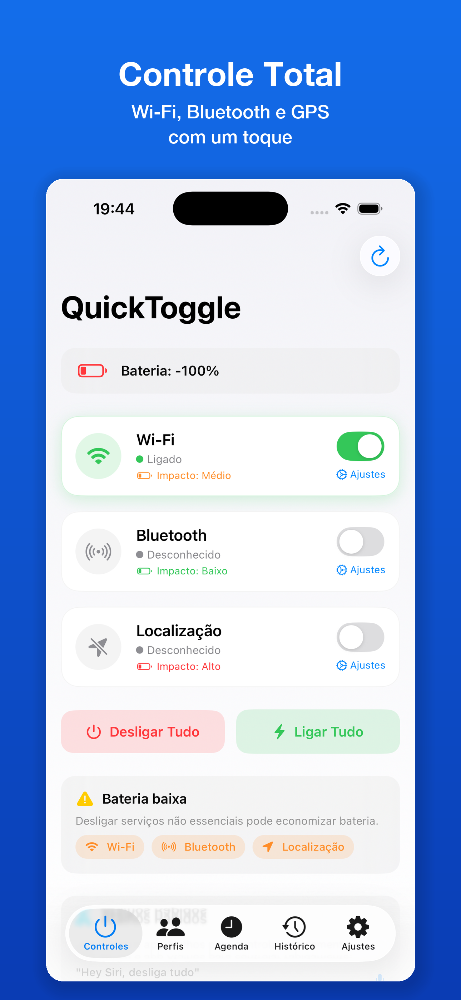
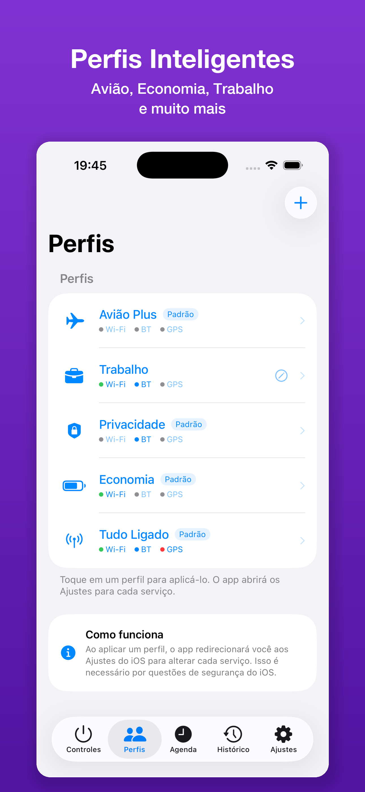
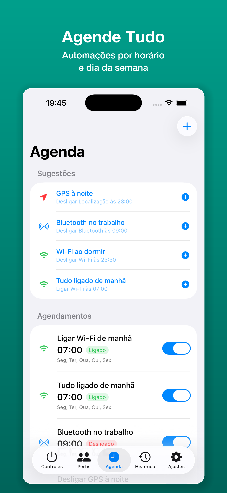
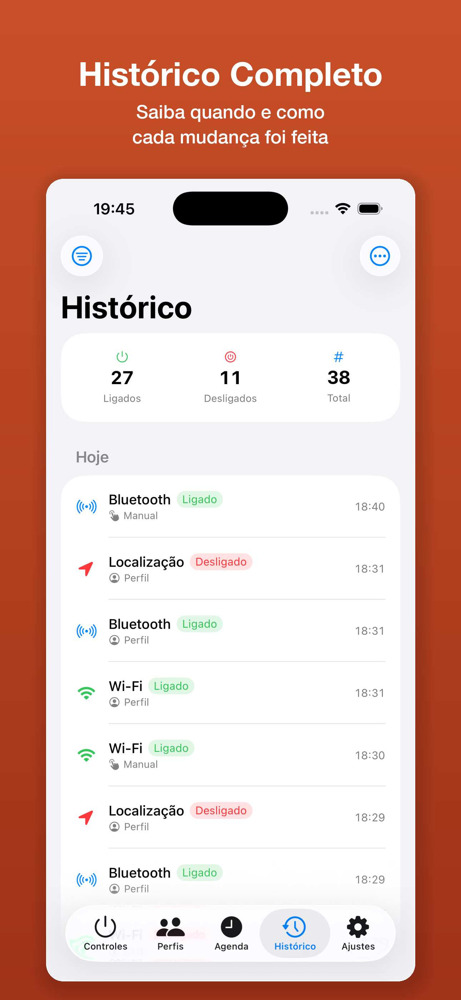
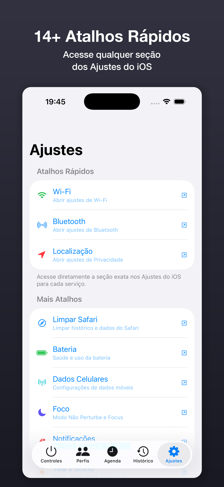

<p align="center">
  
</p>

<h1 align="center">QuickToggle</h1>

<p align="center">
  <strong>Controle rápido de Wi-Fi, Bluetooth e GPS no iOS</strong>
</p>

<p align="center">
  
  
  
  
  
</p>

---

## Screenshots

<p align="center">
  
  &nbsp;
  
  &nbsp;
  
  &nbsp;
  
  &nbsp;
  
</p>

---

## Funcionalidades

### Controle Rápido
- Toggles para **Wi-Fi**, **Bluetooth** e **Localização** com indicadores em tempo real
- Botões **Desligar Tudo** e **Ligar Tudo**
- Monitoramento de bateria integrado
- Alerta de bateria baixa com sugestões de economia

### Perfis Inteligentes
- **4 perfis pré-configurados**: Avião Plus, Economia, Privacidade, Tudo Ligado
- Crie perfis personalizados com ícone e nome
- Aplique configurações com um único toque

### Agendamentos Automáticos
- Agende quando desligar/ligar cada serviço
- **4 presets rápidos**: GPS à noite, Bluetooth no trabalho, Wi-Fi ao dormir, Tudo ligado de manhã
- Repetição por dias da semana
- Notificações nos horários agendados

### Histórico Completo
- Registro de todas as alterações realizadas
- Contadores: ligados, desligados, total
- Filtro por serviço, data e origem (manual, perfil, agendamento)

### 14+ Atalhos para Ajustes do iOS
- Wi-Fi, Bluetooth, Localização
- Limpar Safari, Bateria, Dados Celulares
- Foco, Notificações, Tela e Brilho
- Sons e Hápticos, VPN, Armazenamento, Senhas

### Siri e Shortcuts
- Comandos de voz: *"Hey Siri, desligar Wi-Fi"*
- App Intents para integração com Atalhos
- Control Center Widgets (iOS 18+)

---

## Arquitetura

O projeto segue o padrão **MVVM** com **SwiftUI** + **SwiftData**:

```
QuickToggle/
├── Models/
│   ├── RadioServiceType.swift        # Enum dos serviços (Wi-Fi, BT, GPS)
│   ├── ServiceProfile.swift          # Modelo de perfil (SwiftData)
│   ├── ScheduledAction.swift         # Modelo de agendamento (SwiftData)
│   └── ToggleHistoryEntry.swift      # Modelo de histórico (SwiftData)
├── ViewModels/
│   ├── ToggleViewModel.swift         # Lógica principal de controle
│   ├── ProfileViewModel.swift        # Gerenciamento de perfis
│   └── ScheduleViewModel.swift       # Gerenciamento de agendamentos
├── Views/
│   ├── MainToggleView.swift          # Tela principal de controles
│   ├── ProfilesView.swift            # Tela de perfis
│   ├── ScheduleView.swift            # Tela de agendamentos
│   ├── HistoryView.swift             # Tela de histórico
│   ├── SettingsView.swift            # Tela de ajustes e atalhos
│   ├── BatterySavingView.swift       # Detalhes de economia de bateria
│   └── Components/
│       └── ToggleCardView.swift      # Card de toggle reutilizável
├── Services/
│   ├── RadioControlService.swift     # Controle de rádios e URL schemes
│   ├── BatteryMonitorService.swift   # Monitoramento de bateria
│   └── NotificationService.swift     # Notificações locais
├── Intents/
│   ├── ToggleIntents.swift           # App Intents para Siri/Shortcuts
│   └── ControlCenterWidgets.swift    # Widgets do Control Center
├── Extensions/
│   └── Color+Extensions.swift        # Extensões de cores
├── ContentView.swift                 # TabView principal + URL handling
└── QuickToggleApp.swift              # Entry point
```

---

## Tecnologias

| Tecnologia | Uso |
|---|---|
| **SwiftUI** | Interface do usuário |
| **SwiftData** | Persistência (perfis, agendamentos, histórico) |
| **CoreBluetooth** | Detecção de estado do Bluetooth |
| **CoreLocation** | Detecção de estado da Localização |
| **AppIntents** | Integração com Siri e Atalhos |
| **WidgetKit** | Widgets de tela inicial e Control Center |
| **UserNotifications** | Notificações agendadas |

---

## URL Schemes

O app suporta deep linking via `quicktoggle://`:

| URL | Ação |
|-----|------|
| `quicktoggle://tab/toggles` | Abrir tab Controles |
| `quicktoggle://tab/profiles` | Abrir tab Perfis |
| `quicktoggle://tab/schedule` | Abrir tab Agenda |
| `quicktoggle://tab/history` | Abrir tab Histórico |
| `quicktoggle://tab/settings` | Abrir tab Ajustes |
| `quicktoggle://profile/economia` | Aplicar perfil por nome |
| `quicktoggle://create-profile?name=X&wifi=on&bt=off&gps=off&icon=star.fill` | Criar perfil |
| `quicktoggle://create-schedule?name=X&service=wifi&action=off&hour=23&minute=0&days=1,2,3` | Criar agendamento |
| `quicktoggle://preset/0` | Aplicar preset rápido (0-3) |
| `quicktoggle://open-settings/wifi` | Abrir seção dos Ajustes do iOS |
| `quicktoggle://battery` | Tela de economia de bateria |

---

## Limitações do iOS

> Apps no iOS **não podem** ligar/desligar Wi-Fi, Bluetooth ou GPS diretamente. Esta é uma restrição de segurança da Apple.

| Serviço | Limitação | Solução |
|---|---|---|
| **Wi-Fi** | `NEHotspotConfiguration` apenas configura redes, não desliga Wi-Fi | Redireciona a `App-prefs:WIFI` |
| **Bluetooth** | `CoreBluetooth` detecta estado, não controla globalmente | Redireciona a `App-prefs:Bluetooth` |
| **Localização** | `CLLocationManager` controla permissão do app, não GPS global | Redireciona a `App-prefs:Privacy&path=LOCATION` |

**iOS 26+**: A Apple removeu deep linking para seções específicas dos Ajustes. O app abre a página principal.

---

## Build

```bash
git clone https://github.com/AleCyriaco/QuickToggle.git
cd QuickToggle/QuickToggle
open QuickToggle.xcodeproj
```

Selecione um dispositivo iOS 17+ e pressione **Cmd + R**.

### Requisitos
- iOS 17.0+
- Xcode 16.0+
- Swift 5.9+

---

## Privacidade

O QuickToggle **não coleta nenhum dado pessoal**. Tudo funciona localmente no dispositivo. Veja a [Politica de Privacidade](PRIVACY.md).

---

## Licença

MIT License - veja [LICENSE](LICENSE) para detalhes.
